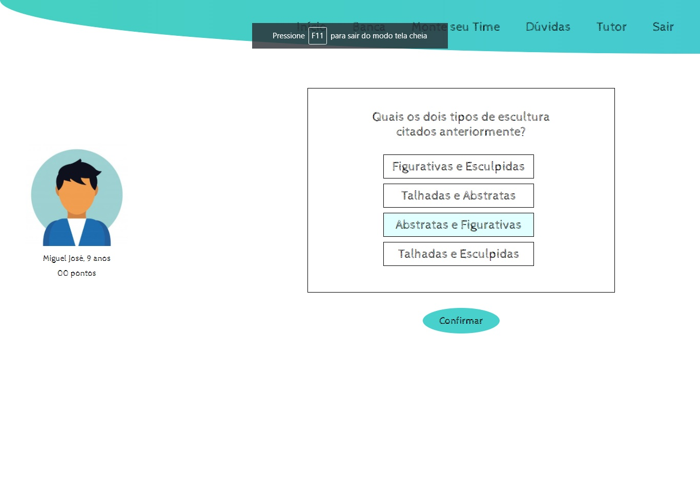
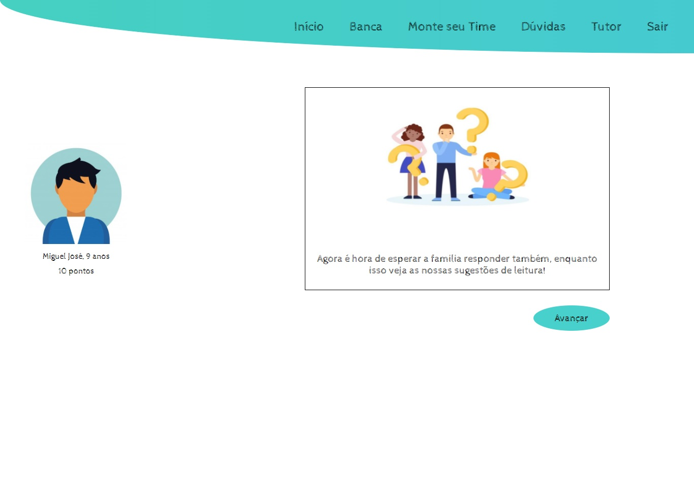
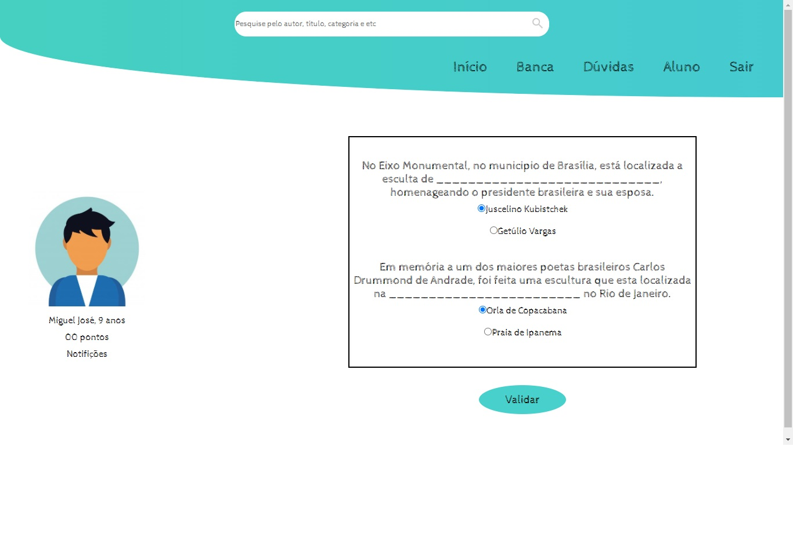
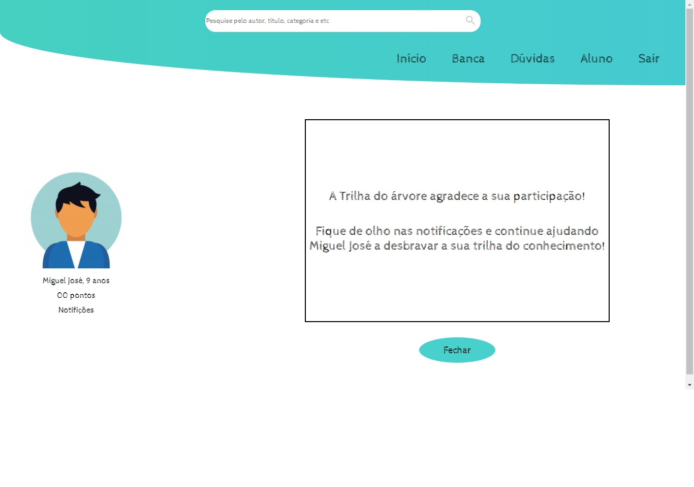

###### Projeto criado para o desafio da empresa Árvore de Livros na semana do Mega Hack Women.

# Trilha
##### Trilha é uma plataforma de interação entre aluno e sua família a qual será inserida no hábito de leitura dos seus filhos.

# Objetivo
##### Seu objetivo geral é motivar as crianças a continuarem lendo já que junto dela terá a família que também irá ter contato com a plataforma para que seu filho continue a trilha e, assim, continuar aprendendo.

