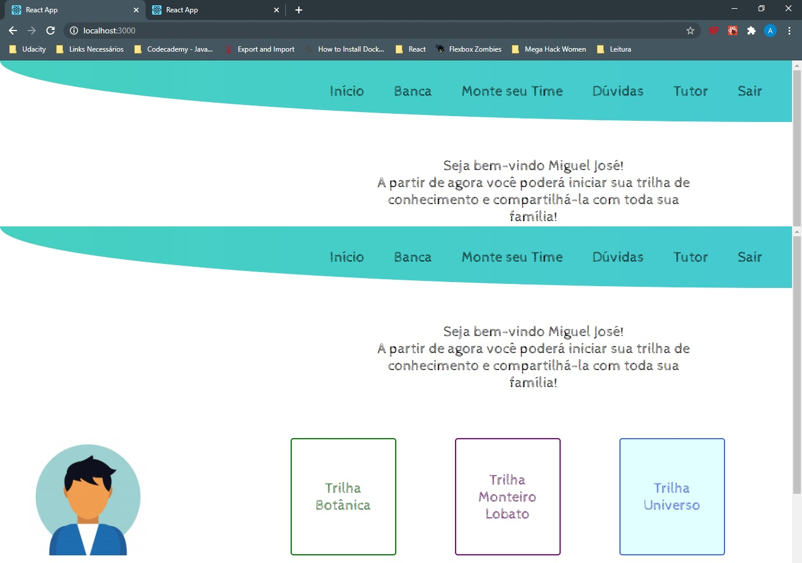
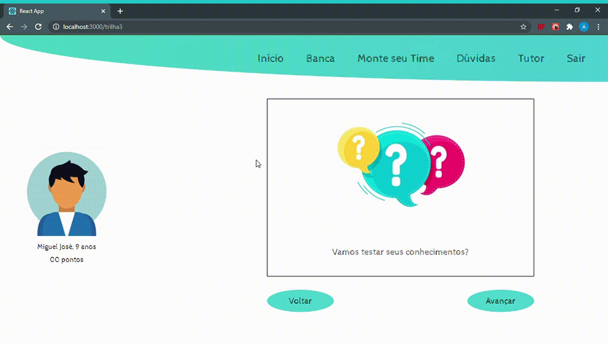
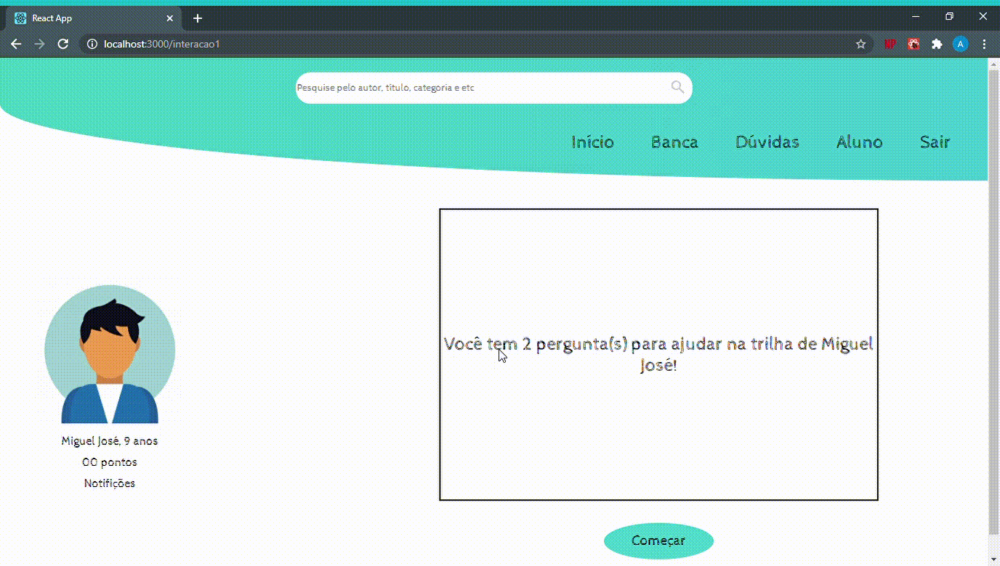

###### Projeto criado para o desafio da empresa Árvore de Livros na semana do Mega Hack Women.

# Trilha
Uma ferramenta idealizada para toda família e que trará para as crianças um ambiente de aprendizagem divertido, lúdico  e único!

# Objetivo
Seu objetivo geral é tornar a leitura um hábito familiar mostrando que o processo de aprendizagem é divertido, além de desafiador

<p align='center'>
    
    
    
    
</p>

### Pré-requisitos

Antes de começar, você vai precisar ter instalado em sua máquina as seguintes ferramentas:
[Git](https://git-scm.com), [Node.js](https://nodejs.org/en/). 
Além disto é bom ter um editor para trabalhar com o código como [VSCode](https://code.visualstudio.com/)

### Baixando o arquivo

```bash
# Clone este repositório
$ git clone <https://github.com/adriavieira314/projetoArvore>

# Acesse a pasta do projeto no terminal/cmd
$ cd projetoArvore

# Execute a aplicação em modo de desenvolvimento
$ npm start

# O servidor inciará na porta:3000 - acesse <http://localhost:3000>
```

### Tecnologia Utilizada

- [ReactJS](https://pt-br.reactjs.org/)

### Autor

Feito com 🏃 por Adria Vieira 👋🏽 Entre em contato!

[](https://www.linkedin.com/in/adria-vieira-60070918b/) 
[](mailto:adriavieira731@gmail.com)