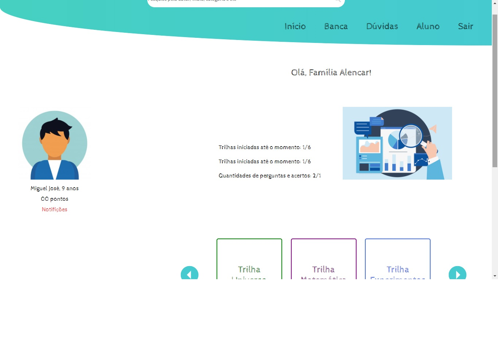

###### Projeto criado para o desafio da empresa Árvore de Livros na semana do Mega Hack Women.

# Trilha
##### Trilha é uma plataforma de interação entre aluno e sua família a qual será inserida no hábito de leitura dos seus filhos.

# Objetivo
##### Seu objetivo geral é motivar as crianças a continuarem lendo já que junto dela terá a família que também irá ter contato com a plataforma para que seu filho continue a trilha e, assim, continuar aprendendo.

<p align='center'>





</p>

### Pré-requisitos

Antes de começar, você vai precisar ter instalado em sua máquina as seguintes ferramentas:
[Git](https://git-scm.com), [Node.js](https://nodejs.org/en/). 
Além disto é bom ter um editor para trabalhar com o código como [VSCode](https://code.visualstudio.com/)

### Baixando o arquivo

```bash
# Clone este repositório
$ git clone <https://github.com/adriavieira314/projetoArvore>

# Acesse a pasta do projeto no terminal/cmd
$ cd projetoArvore

# Execute a aplicação em modo de desenvolvimento
$ npm start

# O servidor inciará na porta:3000 - acesse <http://localhost:3000>
```

### Tecnologia Utilizada

- [ReactJS](https://pt-br.reactjs.org/)

### Autor
--

Feito com 🏃 por Adria Vieira 👋🏽 Entre em contato!

[![Linkedin Badge]](https://www.linkedin.com/in/adria-vieira-60070918b/) 
[![Gmail Badge]](mailto:adriavieira731@gmail.com)